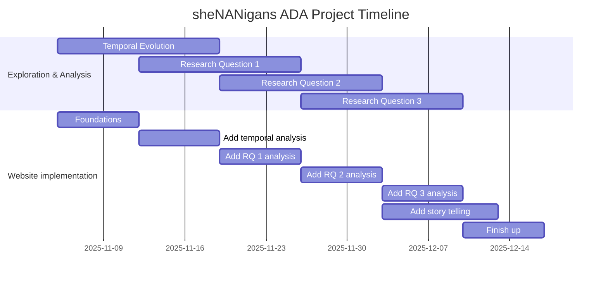

<h1 align="center">
    How indie YouTubers became industry players
      
    
</h1>

> _Analysing content, upload, and sponsorship trends of YouTube channels over time._

## Abstract

At the beginning of YouTube, creators mainly posted for fun - making something to 
entertain others. Back then, people didn't put much thought into making a living out 
of it. Today, we have channels competing to get viewership for monetization and 
partnering with big sponsors, turning entertainment into profit. Clearly, the creator 
focus has evolved from indie content to establishing a profitable brand, which is a 
fantastic representation of professionalisation on social media. 

This project will thus **investigate the professionalisation of YouTube channels** - 
analysing their journey from indie to industry-like creators. Our first step will be 
on ***temporal patterns*** in three key creator metrics: *video duration*, *upload frequency*, 
and *engagement (views, likes, comments)*, to get a good first glance into the data. 

We will then focus on the ***professionalisation*** of channels, where we will quantify 
***when*** we can see clear transitions in adopting professional strategies, analyse
***how*** the creators were able to achieve this, and explore the ***effect*** of this
on the channels and audiences. 

## Research Questions

### 1. How have channels evolved from indie to professional?

- What is the **adoption curve** of sponsorships between different categories?
- When and why do we have a **rise of sponsorships**?
- Have **advertisement strategies** changed over time?
- Do **different channel sizes** employ **different strategies** (_e.g._
  multiple sponsors, recurring sponsors, brand partnerships)?

### 2. What enabled indie channels to become professional-minded?

- At what **subscriber thresholds** do creators start showing **"industry-like"
  patterns** (sponsors, steady uploads, longer videos, higher engagement
  ratios)?
- Are there **early behavioral indicators** (upload rhythm, engagement) that
  predict **professionalisation**?
- Are channel/video **categories and sponsors correlated**?
- Are there **cohorts of channels** with the same/similar sponsors?
- What are the **differences** between categories for **"professional"
  channels** (_e.g._ > 100k subscribers in sports vs education)? How are they
  different?
- Do **"overnight successes"** professionalise faster than slow, organic
  growers?
- Can we detect signs of professionalism by analysing **which videos were later
  removed**, using the
  [**YouTube API**](https://developers.google.com/youtube/v3)?

### 3. How does a focus on professionalism affect engagement?

- Does the **number of views**, **subscriber growth**, **like/dislike ratio**
  change **after channels get sponsors**? How? Any other metrics (tags / length of title)?
- Is it **different between categories**? Is it **different between the years**?
- Do those metrics **change over time** (track **monetised vs non monetised
  channels**)?

## Dataset enrichment

### Sponsor segment analysis
  Use the [**SponsorBlock**](https://github.com/ajayyy/SponsorBlock) crowdsourced
  dataset of sponsored videos: which videos are labelled as having **in-video
  sponsor segments**, what **kind of segments** are they (self-promotion, ad
  read, _etc._), **when** do the sponsor segments occur?

<!-- prettier-ignore-start -->
> [!NOTE]
> Limitations: the crowdsourced dataset started in 2019, thus early videos might
> not be labelled. The project consists in a chrome extension, which might
> attract a tech-savier audience and skew the video topics.
<!-- prettier-ignore-end -->

### Unshortening URLs
  Many URLs in the dataset correspond to shortened URLs
  (_e.g._ [bit.ly](https://bitly.com/)). We could unshorten these by using `GET`
  requests and analysing the responses.

<!-- prettier-ignore-start -->
> [!NOTE]
> Limitations: resolving these links might be unfeasible due to the volume of
> requests to make and parse.
<!-- prettier-ignore-end -->

### Channel and video activity tracking
  Check upload activity for all
  channels and re-query videos to flag active, inactive, deleted, or private
  content using the [**YouTube API**](https://developers.google.com/youtube/v3).
  This would enable comparing of stability between professional and indie
  creators.

<!-- prettier-ignore-start -->
> [!NOTE]
> Limitations: all channels/videos might not be able to be checked due to API
> limits.
<!-- prettier-ignore-end -->

## Methods

### Data pre-processing
- Clean and normalise the data such as empty dates, integers and strings missing, etc.
- Split the data for different categories for comparison (also to break down computational load)
- Extract URLs from descriptions for each video, and unshorten shortened URLs.
- Merge with other datasets, such as labelling certain videos as being sponsored by using SponsorBlock.

### Professionalism Analysis

#### Temporal analysis

- Use time series with moving averages to analyse trends in subscriber counts, views, etc
- Check how different categories evolved over time.

#### Sponsorship detection

- Check if URLs contain links to product sale like amazon, or have donation links like paypal/patreon (using text and regex matching)
- Map videos that have sponsors using the SponsorBlock labels
- Combine upload regularity, count and video lengths to indicate if a channel tries to be more professional
- Clutering methods to group channels by professionalism traits
- Use regression or classification to try to define early indicators of industry-like transitions
- Combine the above with the initial temporal analysis to evaluate engagement effects

### Visualisation
- Create comparisons between categories and their professionalism traits
- Temporal trend plots, network graphs between channels, side by side channel comparisons
- Create a visual story which showcases the evolution of the patterns discovered

## Proposed timeline

## Organisation within the team

- _Ender Sari_: Focus on RQ1 and RQ2
- _Kalan Walmsley_: Focus on preprocessing and RQ2
- _Veronika Wannack_: Focus on website creation and story     
- _Jan Tomasz Juraszek_: Focus on temporal evolution, and RQ3
- _Danael Robert-Nicoud_: Focus on RQ1 and RQ3
