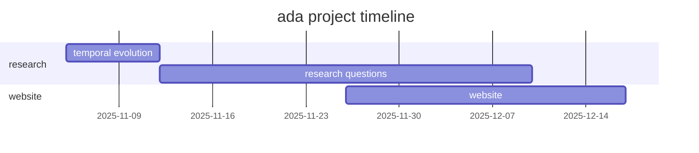

<h1 align="center">
    How indie YouTubers became industry players
      
    
</h1>

> _Analysing duration, uploads, and sponsorship trends of youtube channels over time._

## Abstract

Is there a better way to analyse social media professionalisation than the
YouTube case? On this platform, the creator economy has clearly evolved from
indie uploads to established businesses. We want to quantify and rigorously
analyse these patterns.

This project will investigate the professionalisation of YouTube creators --
analysing the journey from indie channels to industry-like settings. We will
first focus on temporal patterns in three key creator metrics: **video
duration**, **upload frequency**, and **engagement (views, likes, comments)**.
We will then dive into the **professionalisation of indie creators**. Using a
large panel of [**YouTube data**](https://github.com/epfl-dlab/YouNiverse)
spanning from 2005 to 2019, we will quantify how and when creators adopt
professional strategies, and what the effects are on their channels and
audiences. To do this, we identified
[**3 main research questions**](#research-questions) that we aim to answer with
**reproducible, data-driven methods**.

## Research Questions

#### 1. How have channels evolved from indie to professional?

- What is the **adoption curve** of sponsorships between different categories?
- When and why do we have a **rise of sponsorships**?
- Have **advertisement strategies** changed over time?
- Do **different channel sizes** employ **different strategies** (_e.g._
  multiple sponsors, recurring sponsors, brand partnerships)?

#### 2. What enabled indie channels to become professional-minded?

- At what **subscriber thresholds** do creators start showing **"industry-like"
  patterns** (sponsors, steady uploads, longer videos, higher engagement
  ratios)?
- How does being sponsored **change the channel**? Is channel **growth** (weekly
  subscribers / views) correlated with **production investment signals** such as
  upload density or runtime? Any other metrics (tags / length of title)?
- Are there **early behavioral indicators** (upload rhythm, engagement) that
  predict **professionalisation**?
- Are channel/video **categories and sponsors correlated**?
- Are there **cohorts of channels** with the same/similar sponsors?
- What are the **differences** between categories for **"professional"
  channels** (_e.g._ > 100k subscribers in sports vs education)? How are they
  different?
- Do **"overnight successes"** professionalise faster than slow, organic
  growers?
- Can we detect signs of professionalism by analysing **which videos were later
  removed**, using the
  [**YouTube API**](https://developers.google.com/youtube/v3)?

#### 3. How does a focus on professionalism affect engagement?

- Does the **number of views**, **subscriber growth**, **like/dislike ratio**
  change **after the first sponsor** appears? How?
- Is it **different between categories**? Is it **different between the years**?
- Do those metrics **change over time** (track **monetised vs non monetised
  channels**)?

## Dataset enrichment

- **Sponsor segment analysis**: Use the
  [**SponsorBlock**](https://github.com/ajayyy/SponsorBlock) crowdsourced
  dataset of sponsored videos: which videos are labelled as having **in-video
  sponsor segments**, what **kind of segments** are they (self-promotion, ad
  read, _etc._), **when** do the sponsor segments occur?

<!-- prettier-ignore-start -->
> [!NOTE]
> Limitations: the crowdsourced dataset started in 2019, thus early videos might
> not be labelled. The project consists in a chrome extension, which might
> attract a tech-savier audience and skew the video topics.
<!-- prettier-ignore-end -->

- **Unshortening URLs**: many URLs in the dataset correspond to shortened URLs
  (_e.g._ [bit.ly](https://bitly.com/)). We could unshorten these by using `GET`
  requests and analysing the responses.

<!-- prettier-ignore-start -->
> [!NOTE]
> Limitations: resolving these links might be unfeasible due to the volume of
> requests to make and parse.
<!-- prettier-ignore-end -->

- **Channel and video activity tracking**: check upload activity for all
  channels and re-query videos to flag active, inactive, deleted, or private
  content using the [**YouTube API**](https://developers.google.com/youtube/v3).
  This would enable comparing of stability between professional and indie
  creators.

<!-- prettier-ignore-start -->
> [!NOTE]
> Limitations: all channels/videos might not be able to be checked due to API
> limits.
<!-- prettier-ignore-end -->

## Methods

<!-- TODO -->

## Proposed timeline

## Organisation within the team

- _Ender Sari_:

- _Kalan Walmsley_:

- _Veronika Wannack_:

- _Jan Tomasz Juraszek_:

- _Danael Robert-Nicoud_:
