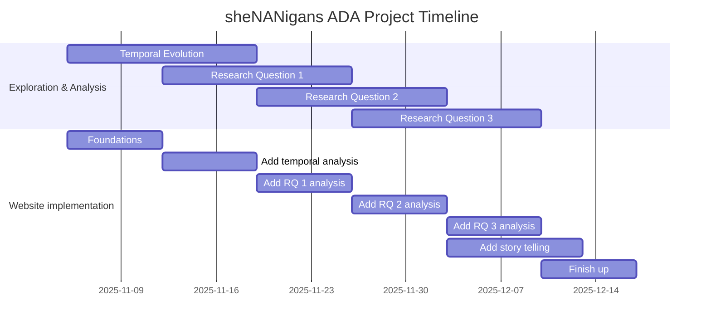

<h1 align="center">
    How indie YouTubers became industry players
      
    
</h1>

> _Analysing content, upload, and sponsorship trends of YouTube channels over
> time._

## The Website

The final website can be found here: https://ri-ru.github.io/ADA-website/

The repository for the website can be additionally found here: https://github.com/ri-ru/ADA-website

## Abstract

At the beginning of YouTube, creators mainly posted for fun - making something
to entertain others. Back then, people didn't put much thought into making a
living out of it. Today, we have channels competing to get viewership for
monetization and partnering with big sponsors, turning content into profit.
Clearly, the creator focus has evolved from indie content to establishing a
profitable brand, which is a fantastic representation of professionalisation on
social media.

This project **investigated the professionalisation of YouTube channels** -
analysing their journey from indie to industry-like creators. We attempted to
quantify **_when_** we can see clear transitions in adopting professional
strategies, analyse **_how_** the creators were able to achieve this, and
explore the **_effect_** of this on the channels and audiences.

## Research Questions

### 1. How have channels evolved from indie to professional?

- How did the **YouTube ecosystem change** as it grew bigger?
- Did all categories **grow in the same way?**
- How did **different types of links** (content, social, monetization) spread
  and change over time?
- Which categories used **monetization links** the most?
- Did channels become professional all at once or gradually?

### 2. What enabled indie channels to become professional-minded?

- **How long** does one need to have a channel to obtain a sponsor?
- **At what thresholds** (views, subscribers, videos, activity) do creators
  obtain their first sponsorship?
- Are certain **topic transitions** common after the first sponsorship?
- How does getting sponsored affect **channel longevity**?
- Are there **cohorts of channels** with the same/similar sponsors?

### 3. How does a focus on professionalism affect engagement?

- Are **like/dislike ratios**, **video durations**, **view counts** different
  between sponsored and unsponsored channels? Is it **different between
  categories**?
- Do the **number of views** and the **subscriber growth** change **after
  channels get sponsored**?

## Dataset 

We use two datasets: YouNiverse and SponsorBlock 

The YouNiverse dataset, produced by the ADA lab at EPFL, provides a large-scale overview of the English-language YouTube ecosystem. It incorporates metadata for more than 72.9 million videos and 153,550 channels with weekly time series, totally 18,872,499 observations. 

SponsorBlock is an open-source browser extension enabling users to automatically skip chosen types of segments on YouTube videos (preview, credits, sponsor segments, ...) and it is crowdsourced: users submit the start and end times of these segments. For this project, only the sponsor segment category is selected, thus including only videos with paid promotional content for a brand or product.

## Dataset enrichment

### Sponsor segment analysis

We used the [**SponsorBlock**](https://github.com/ajayyy/SponsorBlock)
crowdsourced dataset to label videos as sponsored. The crowdsourced dataset
started in 2019, but we found pretty uniform labelling for all years in the
YouNiverse dataset.

### Unshortening URLs

Many URLs in the dataset corresponded to shortened URLs (_e.g._
[bit.ly](https://bitly.com/)). We unshortened the subset of URLs from sponsored
videos.

### Channel and video activity tracking

The activity of channels in 2025 was verified using the
[**YouTube API**](https://developers.google.com/youtube/v3). This would enabled
comparing of stability between professional and indie creators.

## Methods

The bulk of the analysis is detailed [in this notebook](milestone_p3.ipynb).

### Main approach - R1 - Platform Evolution 

Analysis of upload volumes across categories

Classification of links and adoption rate tracking

Cross-category comparisons of industry-like patterns

### Main approach - R2 - Path to Sponsorship

Distribution fitting for time-to-first-sponsor 

Log-normal distribution analysis for video count thresholds

Category transition analysis using 6-month windows before/after first sponsorship

Channel-sponsor network construction with Leiden community detection

Paired t-test comparing sponsored vs. non-sponsored channel longevity

### Main approach - R3 - Engagement Analysis

Dumbbell plots comparing sponsored vs. non-sponsored video metrics

Time-series analysis of delta_views and delta_subs around first sponsorship

Engagement comparisons

## Main takeaways 

YouTube grew enormously in volume from 2008 to 2018. Creators professionalized in different ways: adding monetization, social, and content links. Different categories did it at different speeds.

On median, it takes <b>~3 years</b> and <b>~148 videos</b> to land your first sponsor. Sponsored channels are <b>16% more likely</b> to still be active in 2025. Thresholds for views, subs, and videos <b>vary with category</b>.

Sponsored videos get <b>more views</b>, are <b>longer</b>, and have <b>higher like ratios</b>. But after your first sponsor, growth rate <b>slows down</b>! 

## Initial timeline

## Contributions

- _Ender Sari_: Focus on research question 1 and YouTube data enrichment. 
   Website implementation for question 1.
- _Kalan Walmsley_: Performance-intensive data preprocessing. Focus on research
  question 2. Website implementation. WebAssembly graph visualisation. Cleaning and preparing P3 submission. 
- _Danael Robert-Nicoud_: Focus on research question 3.
- _Veronika Wannack_: Website design and implementation, cleaning and preparing P3 submission. 
- _Jan Tomasz Juraszek_: Website implementation and story, cleaning and preparing P3 submission. 
